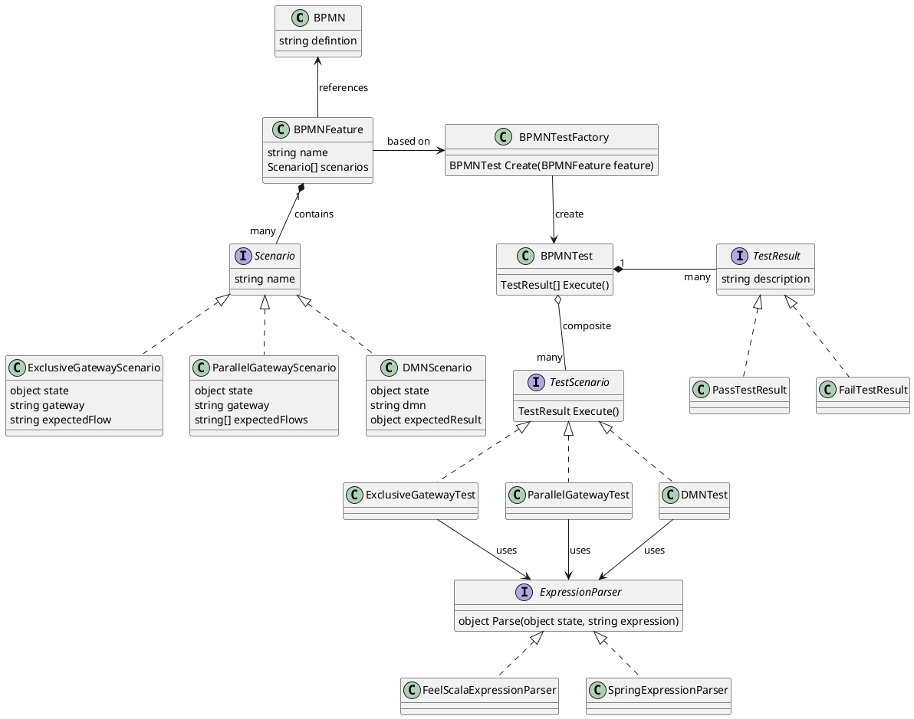

# BPMN Tester

De business is eigenaar van alle business interfaces waaronder ook de bedrijfsprocessen. Als eigenaar moeten zij dan ook correcte processen in BPMN formaat opleveren. Processen bevatten ook logica, denk hierbij aan gateways en DMN modellen. Deze logica moet, net als alle andere logica, als unit automatisch getest kunnen worden.

## Achtergrond

Logica (expressies) worden in FEEL formaat geschreven. FEEL is een DMN standaard zoals [beschreven in de DMN specificatie.](https://www.omg.org/spec/DMN/). Zie ook [Camunda documentatie](https://docs.camunda.io/docs/reference/feel/what-is-feel/) voor meer informatie.

Er bestaan verschillende implementaties van de expressie taal:

* [Canmunda FEEL parser](https://camunda.github.io/feel-scala/);
* [Spring expression language (SPEL) parser](https://docs.spring.io/spring-framework/docs/3.0.x/reference/expressions.html)

De implementatie moet via dependency injectie te configureren zijn.

## Gewenst resultaat

Logica in een proces moet via een yaml test specificatie automatisch getest worden.

* Een script zoek recursief naar alle *.bpmn.tests bestanden. Voor elke test bestand moet het bpmn bestand (- .tests extenstie) bestaan.
* Het .bpmn.tests bestand wordt gevalideerd op juistheid (parsen naar POJO bestanden);
* Het .bpmn bestand wordt gevalideerd op juistheid (https://github.com/bpmn-io/bpmn-js-bpmnlint);
* Voor elke test word de logica opgezocht in de process definitie:
*   * de expressies van alle uitgaande gateway flows aan de hand van `when_executing_gateway`;
    * de DMN expressie op basis van `when_executing_decision`;
* Elke expressie en `given_state` wordt m.b.v. van de expression parser implementatie uitgevoerd;
* Het uitkomst wordt vergeleken met het verwachte resultaat: `expect_flow_activated` of `expect_result`

Het formaat beschrijft naam van de test, de proces data, het id van de gateway of decision model dat uitgevoerd moet worden en het verwachte resultaat (geactiveerde route of resultaat).

```yaml
scenarios:
  - exclusive_gateway:
      name: name_of_test_scenario 
      state: state_object    
      gateway: id_of_gateway
      flow: id_of_flow
  - parallel_gateway:
      name: name_of_test_scenario 
      state: state_object    
      gateway: id_of_gateway
      flows:
        - id_of_flow
        - id_of_flow
  - dmn:
      name: name_of_test_scenario 
      state: state_object    
      dmn: id_of_decision_model
      result: result_object
```

Ze voor een voorbeeld implementatie de volgende bestanden:

* https://github.com/synionnl/website/blob/feature/bot/docs/blog/bizdevops/living-documentation/process.feature
* https://github.com/arjangeertsema/hexagonal-architecture/blob/main/Domain/Domain.UseCases.Tests/Steps/ProcessStepDefintions.cs

## Delevirables

* Test script
* Docker file
* [Github workflow action](https://docs.github.com/en/actions/creating-actions/creating-a-docker-container-action)

## Class diagram



## Pseudo code

### Main

```java
var results = []
var features > *.bpmn.tests files

foreach var feature in features
  var test = testFactory.create(feature)    
  results.add(test.execute())

export(results) //Zodat het gebruikt kan worden in de living documentation pipeline].

foreach var result in results
  assert(result);
```

### ExclusiveGatewayTest

```java
ExclusiveGatewayTest.Execute(GatewayScenario scenario) =>
  var gateway = bpmn.findGateway(scenario.gateway)

  if(gateway == null)
    return new FailTestResult(scenario, "Gateway not found")

  var defaultFlow = gateway.flows
    .singleOrDefault(flow => flow.id == gateway.defaultFlow)

  var activatedFlow = gateway.flows
    .where(flow => 
      flow.id != gateway.defaultFlow && 
      expressionParser.parse(scenario.state, flow.expression) == true
    )
    .singleOrDefault()

  if(activatedFlow?.id != scenario.expectedFlow and defaultFlow?.id != scenario.expectedFlow)
    return new FailTestResult(scenario, "Expected flow is not activated")

  return new PassTestResult(scenario)
```