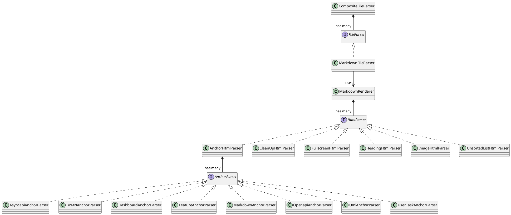

# md-docs cli

## Product

md-docs is a cli tool which generates a static webiste by resolving files recursivly from a source folder.

This script copies every file and directory from the **docs** directory into the **dist** directory and transforms every `*.md` file into a html file while adding the following features:

1. Every index.md is transformed in a static web page;
1. Every index.md is added to the menu;
1. Every heading is automaticly converted into a container;
1. Every `*.bpmn` anchor is automaticly [converted](https://bpmn.io/toolkit/bpmn-js/) into a bpmn.io viewer;fir
1. Every `*openapi.yaml` anchor is automaticly [converted](https://github.com/OpenAPITools/openapi-generator) into a html documentation page;
1. Every `*asyncapi.yaml` anchor is automaticly [converted](https://github.com/asyncapi/generator) into a html documentation page;
1. Every `*.feature` anchor is automaticly converted into a feature details list;
1. Every `*.dashboard.yaml` anchor is automaticly converted into a BDD dashboard;
1. Every `*.user-task.yaml` anchor is automaticly converted into a user-interface;
1. Every `*.puml` anchor is automaticly [converted](https://plantuml.com/) into an svg image file;
1. Every markdown anchor is automaticly converted into an html link;
1. Every markdown anchor which starts with an `_` is automaticly added to the markdown file; 
1. Every git branch is added to the git menu;
1. Test executions are automaticly parsed in feature files;
1. Unsorted list with items which reference the files above are automaticly converted in tab panels;
1. Images are wrapped in figures;
1. Images can be alligned by adding align=center or align=left or align=right to the url;
1. Markdown is transformed into html using [markdow-it](https://www.npmjs.com/package/markdown-it), the following plugins are installed:
    * [markdown-it-multimd-table](https://www.npmjs.com/package/markdown-it-multimd-table) => additional table options;
    * [markdown-it-container](https://www.npmjs.com/package/markdown-it-container) => info, warning and error containers;
    * [markdown-it-toc-done-right](https://www.npmjs.com/package/markdown-it-toc-done-right) => table of contents for h1, h2 and h3;    
    * [markdown-it-plantuml-ex](https://www.npmjs.com/package/markdown-it-plantuml-ex) => UML is automaticly converted into a SVG;
    * [markdown-it-abbr](https://www.npmjs.com/package/markdown-it-abbr);
    * [markdown-it-codetabs](https://www.npmjs.com/package/markdown-it-codetabs);
    * [markdown-it-attrs](https://www.npmjs.com/package/markdown-it-attrs);

All links are relative so you do not need a webserver.

## Architecture

The application is written in node js and implements a plug in architecture. It uses [Awilix](https://github.com/jeffijoe/awilix/) under the hood for dependency resolving. Plugins can be used by extending App and adding or replacing service registrations.

There are several plugin strategies:

1. add or change the file parsers;
1. add or change the html parsers;
1. add or change the anchor parsers;
1. change components;
1. change component render functions;

```js
module.exports = MyApp extends App {
    constructor(options) {
        super(options);
    }

    _getServices(options) {
        const services = super(options);

        //Option 1
        services['newFileParser'] = asClass(NewFileParser).singleton();
        services.fileParsers = services.fileParsers.push('newFileParser');

        //Option 2
        services['newHtmlParser'] = asClass(NewHtmlParser).singleton();
        services.htmlParsers = services.htmlParsers.push('newHtmlParser');


        //Option 3
        services['newAnchorParser'] = asClass(NewAnchorParser).singleton();
        services.anchorParsers = services.anchorParsers.push('newAnchorParser');
        
        //Option 4
        services.pageComponent = asClass(MyPageComponent);

        //Option 5
        services.pageComponentRenderFn = asValue((data) => '<html />');

        return services;
    }
}
```

## Class diagram

