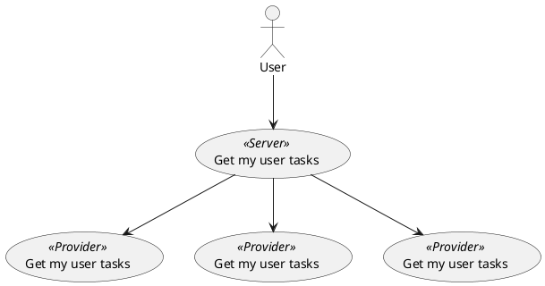

# User task server

The user task server acts as an aggregator. It asks, on behalve of a user, every [user task provider] to return a maximum of n tasks. 
The [user task provider] returns tasks which are claimed by the user or unclaimed task which can be claimed by the user (is authorized to claim).
All the responses are aggregated into one collection containing a maximum of n tasks ordered by a [order algorithm].

The user task server is a stateless service and it depends on decentralized state provided by the [user task provider]s. Alle logic related to user task urgency, user task authorization and user task handling is implemented by the [user task provider].

The [service registry pattern] is used to discover [user task provider] instances.

When a user has claimed a task the user must complete, delegate or delay the task before claiming a new task.

## Order algorithm

The user tasks are ordered by urgency. The urgency is based on the following criteria:

* When is the user task created?
* What is the user task due date?
* What is the priority of the user task?

## Command & queries

[commands and queries](openapi.yaml)

[service registry pattern]: https://www.nginx.com/blog/service-discovery-in-a-microservices-architecture/
[user task provider]: ../user-task-provider/index.md
[order algorithm]: #order-algortithm